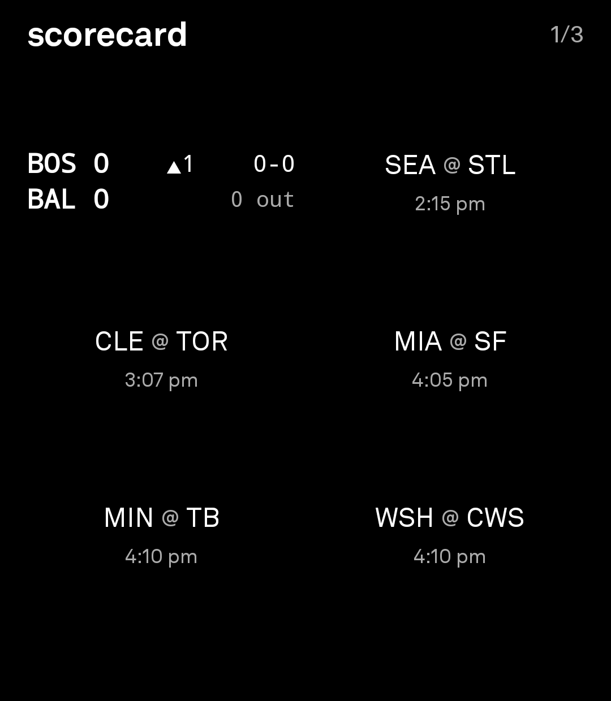
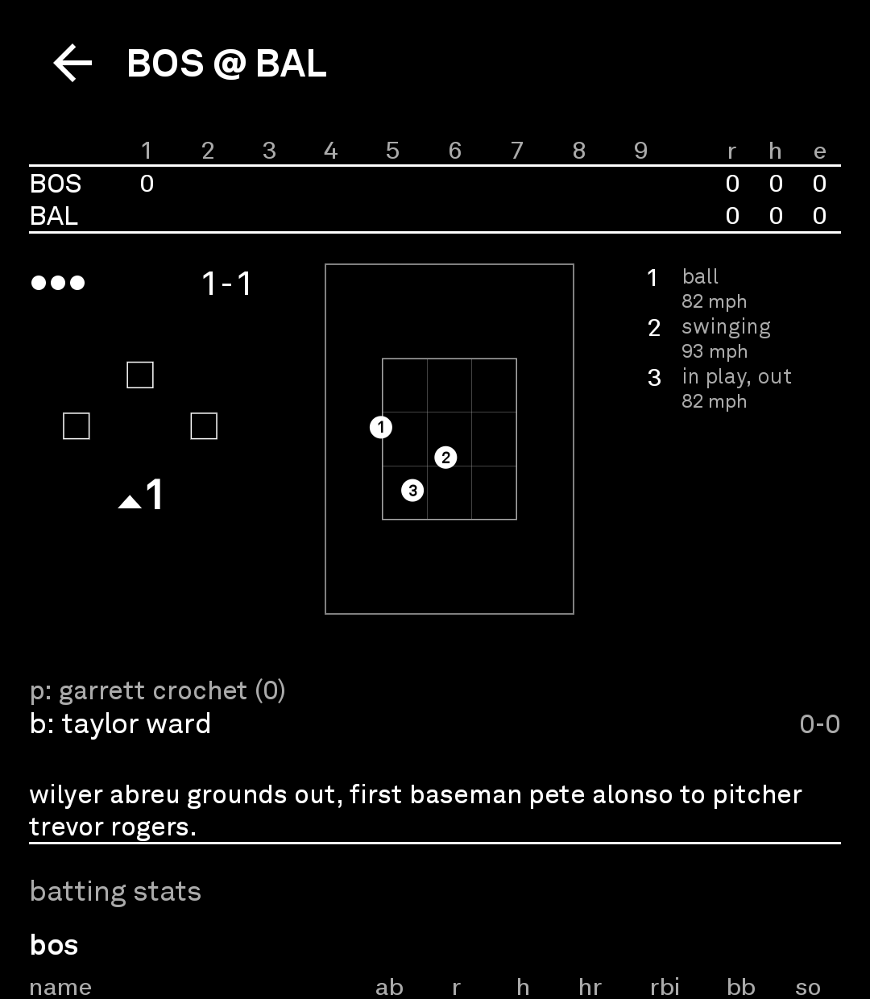
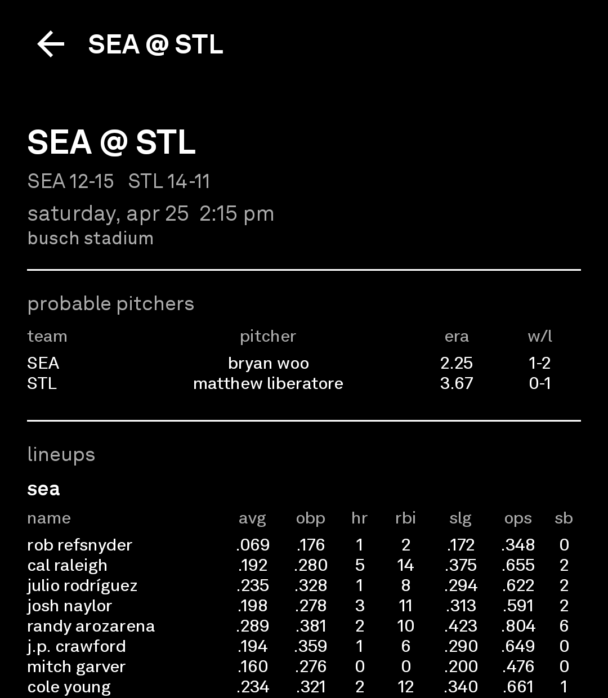
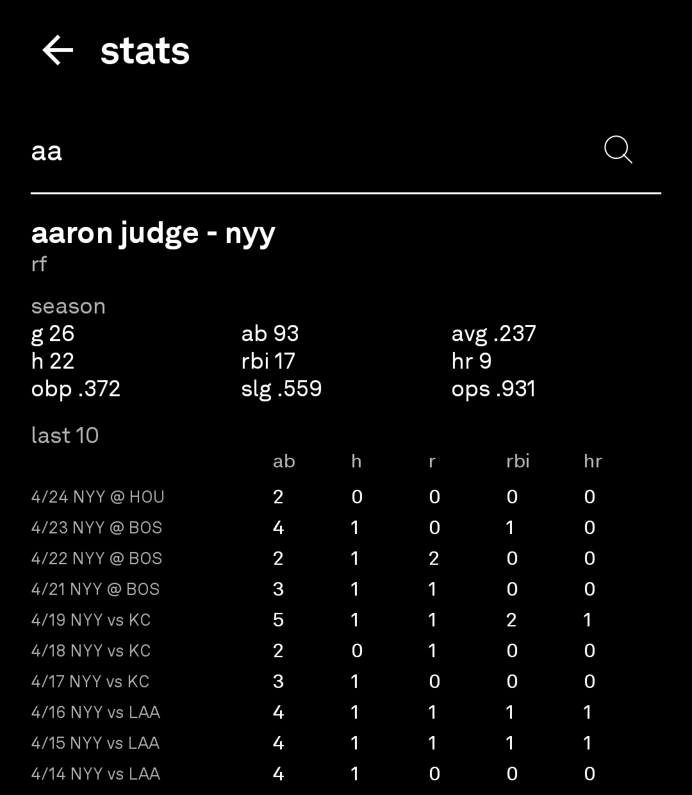

# scorecard

Minimal baseball scores for android, built for light phone iii.

scorecard is written in kotlin with jetpack compose and material3 primitives.
it uses ktor + kotlinx.serialization against the public MLB Stats API, with no account system, ads, analytics, or api keys.
the interface is intentionally black-and-white, low-motion, and low-data friendly.

## screenshots

| home | live |
|---|---|
|  |  |

| pregame | stats |
|---|---|
|  |  |

## features

- today's mlb slate with live, upcoming, and final games
- live pitch/count/base state and box score
- pregame probable pitchers and lineups
- final linescore and player stat lines
- favorite teams, low data mode, background refresh, keep-awake option
- standings and player stat search

## data source

scorecard uses the public MLB Stats API. no api key, account, ads, analytics, or third-party service SDKs.

## build

Create `local.properties` with your Android SDK path:

```properties
sdk.dir=C:/Android/sdk
```

For release builds, add signing properties locally. Do not commit these:

```properties
scorecard.storeFile=release/scorecard-release.jks
scorecard.keyAlias=scorecard
scorecard.storePassword=...
scorecard.keyPassword=...
```

Build debug:

```powershell
.\gradlew.bat assembleDebug
```

Build signed release APK and Play Store bundle:

```powershell
.\gradlew.bat assembleRelease bundleRelease
```

Outputs:

- `app/build/outputs/apk/release/app-release.apk`
- `app/build/outputs/bundle/release/app-release.aab`

## distribution

Do not commit APKs, AABs, keystores, or `local.properties` to the repo.

Upload APKs/AABs separately as GitHub Release assets or through Google Play Console.
